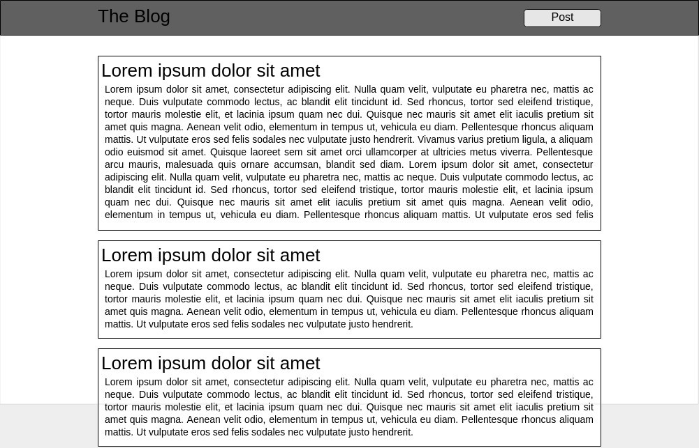
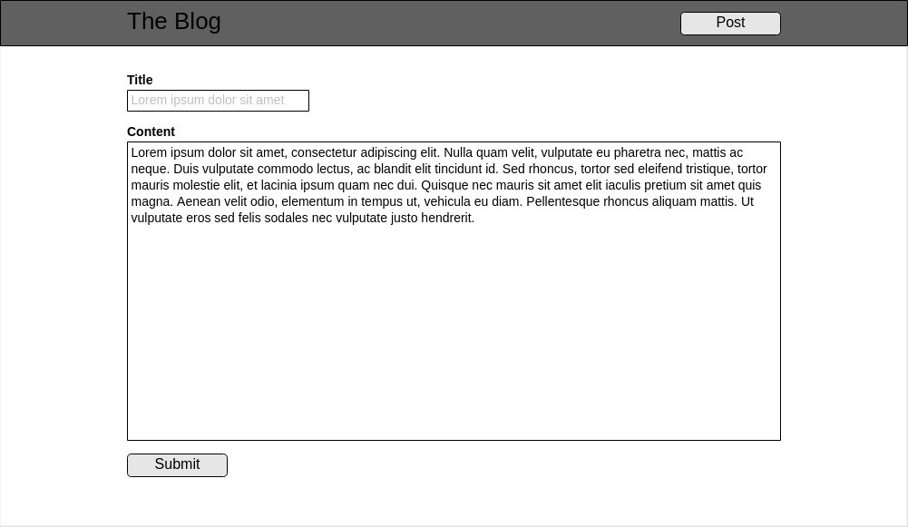

# Blog Project

We are going to build our first big project. It is going to be a static blog
site customized by You! It will have two features by default, but feel free to
add your own later.

## Views

- List the posts
  
- Submit new post
  

## How to start

- Create a new folder for this exercise
- You will need 2 HTML and 1 CSS files
- Think about the HTML structure
  - How many `div` elements will be needed?
- Finish the HTML structure first and then add CSS
  - Why?
    Because the design should not define the structure of our document
- Make it your own: add your design!
