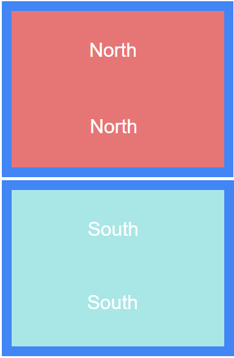
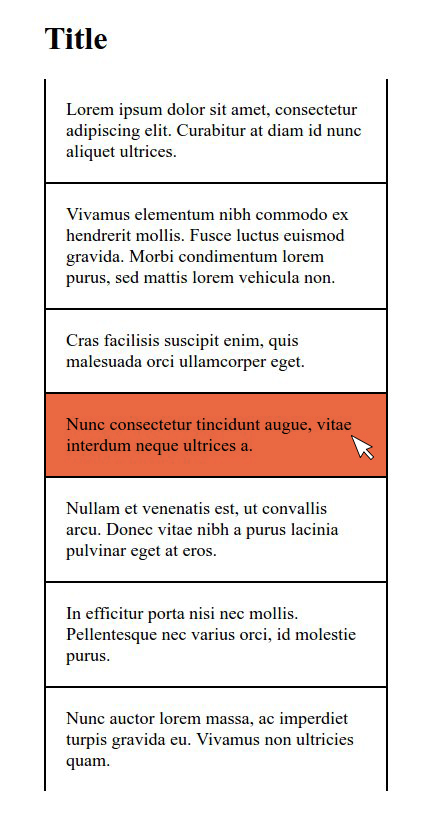

# Introduction to Web development basics

## Workshop

- Separate your solutions into different folders
- Keep in mind that it does not have to be [pixel-perfect](http://lmgtfy.com/?q=What+does+%22pixel+perfect%22+mean%3F)
- Do not forget to download [the duck](assets/the-duck.png)

### Exercise 1

### Exercise 2

### Exercise 3

### Exercise 4

### Exercise 5

### Exercise 6

### Exercise 7

